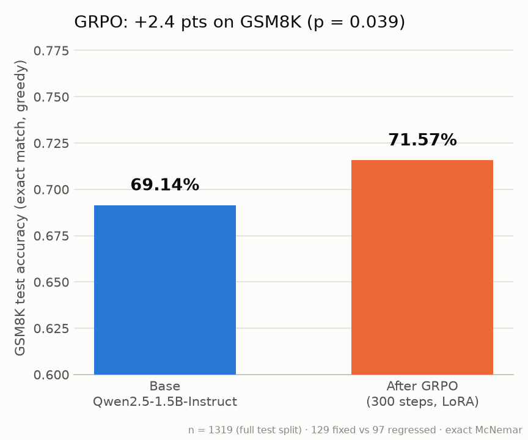
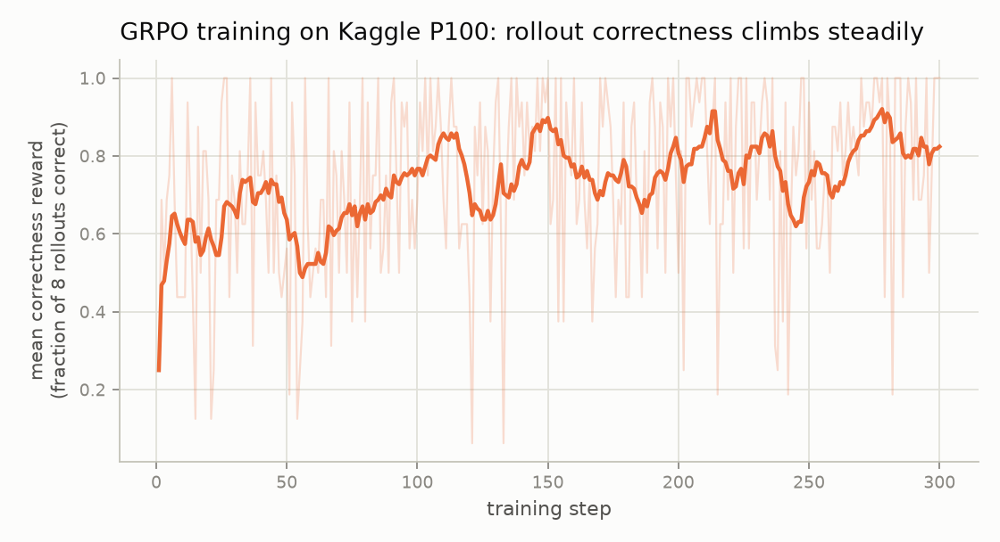
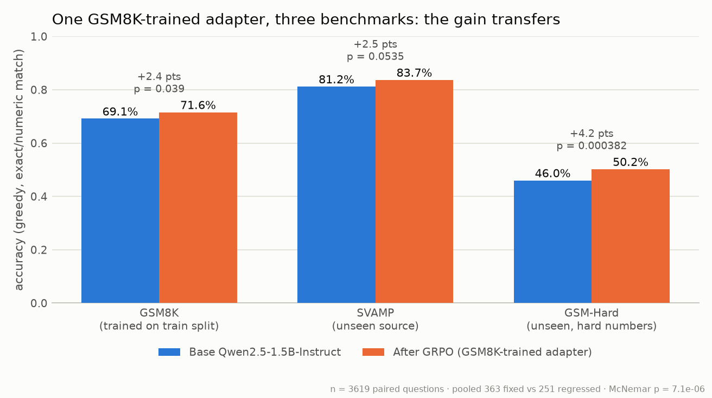

# grpo-reasoner

**RL fine-tuning a small LLM for math reasoning with GRPO — with the evaluation
rigor most GRPO demos skip.**

Qwen2.5-1.5B-Instruct, trained with GRPO (the reinforcement-learning algorithm
behind DeepSeek-R1) against a verifiable correctness reward on GSM8K, entirely on
free compute (a single Kaggle P100). Evaluated on the **full 1,319-question held-out
test split** with a **paired significance test** — not a cherry-picked subset.

| | Base Qwen2.5-1.5B-Instruct | After GRPO (300 steps, LoRA) |
|---|---|---|
| GSM8K test accuracy (greedy, exact match) | 69.14% | **71.57%** |

**+2.43 points · 129 questions fixed vs 97 regressed · exact McNemar p = 0.039 · n = 1,319**



The training signal was genuinely learned, not memorized noise — mean rollout
correctness during training climbed from 0.25 to 0.82:



## v0.2 — does the gain transfer? (yes, and most where arithmetic is hardest)

The same adapter — trained only on GSM8K's train split — evaluated on two
benchmarks it never saw, base vs trained, greedy, paired McNemar:

| Benchmark | n | Base | After GRPO | Δ | fixed / regressed | p |
|---|---|---|---|---|---|---|
| **GSM-Hard** — GSM8K questions with large/awkward numbers | 1,300 | 46.0% | **50.2%** | **+4.2** | 144 / 89 | **0.0004** |
| **SVAMP** — different source, built to defeat pattern-matching | 1,000 | 81.2% | **83.7%** | +2.5 | 90 / 65 | 0.054 |
| GSM8K (v0.1, for reference) | 1,319 | 69.1% | 71.6% | +2.4 | 129 / 97 | 0.039 |



Reading it honestly: GSM-Hard is unambiguous — the adapter makes the model
markedly more robust when the arithmetic gets hard, which is the most plausible
thing for a correctness reward to teach. SVAMP is positive and consistent in
direction but *borderline* (p = 0.054) and is reported as such, not as
significant. Pooled over all 3,619 paired questions: 363 fixed vs 251 regressed
(p ≈ 7e-6). Per-question files for every benchmark are in `results-transfer/`.

## What this is

GRPO (Group Relative Policy Optimization) samples a *group* of completions per
question, scores each with a reward function, and pushes the policy toward the
above-average completions — using the group mean as the baseline, so no value
network is needed. Because GSM8K answers are verifiable (`#### 42`), the reward
is exact: no judge model, no reward hacking via fuzzy scoring.

- **`grpo_reasoner/rewards.py`** — the heart: a verifiable correctness reward
  (extract the final `\boxed{}` number, exact-match against gold) plus a small
  format-shaping reward, deliberately capped so a wrong-but-well-formatted answer
  can never out-earn a correct one. 17 unit tests.
- **`grpo_reasoner/eval.py`** — strict eval harness: greedy decoding, the *same*
  extractor as the training reward, held-out test split only, per-question JSONL
  output so claims can be audited.
- **`grpo_reasoner/majk.py`** — self-consistency (maj@k) evaluation, the sampling
  metric GRPO most directly optimizes.
- **`train_grpo.py`** — TRL `GRPOTrainer` + LoRA (r=16), `beta=0` (no reference
  model — R1-Zero style, halves memory), `dr_grpo` loss (length-bias-corrected).
- **`plot_results.py`, `eval_majk_compare.py`** — results generation.

## The honest experimental trail

This repo reports its failures, because they changed the design:

1. **Qwen2.5-0.5B, 400 steps, local 8GB GPU.** Training reward doubled
   (0.2 → 0.55) but held-out accuracy didn't move: +1.2 greedy (p ≈ 0.3),
   **−4.0 maj@8**. Diagnosis: one prompt-group per step × 400 unique prompts =
   the policy adapted to the prompts it saw rather than learning transferable
   reasoning. A training-reward curve going up is *not evidence of generalization*.
2. **Qwen2.5-1.5B, 300 steps, Kaggle P100, 2× the effective batch.** A first
   look at n=300 showed +2.7 (p = 0.30 — not yet evidence). Extending to the
   full 1,319-question test split: **+2.43, p = 0.039**. Same conclusion under
   the paired view: 129 fixes vs 97 regressions.
3. maj@8 stayed flat in both runs — the gain here is in greedy reasoning
   reliability, not in the sampled-answer distribution. Reported as-is.

## Reproduce

```bash
pip install -e .
pytest tests/            # reward/data logic, no GPU needed

# baseline + trained eval (adapter included in adapter-1.5b/)
python -m grpo_reasoner.eval --model Qwen/Qwen2.5-1.5B-Instruct --limit 300
python -m grpo_reasoner.eval --model Qwen/Qwen2.5-1.5B-Instruct --adapter adapter-1.5b --limit 300

# train (Kaggle T4/P100 16GB or any >=12GB GPU; ~3h)
python train_grpo.py --model Qwen/Qwen2.5-1.5B-Instruct \
    --max-steps 300 --num-generations 8 --per-device-batch 8 --grad-accum 2 \
    --max-completion-length 384 --lr 5e-6
```

`notebooks/kaggle_train.md` documents the free-tier Kaggle recipe, including the
P100 environment repairs (torch sm_60 build, stale accelerator-lib removal) that
the stock image needs.

## Design notes

- **Verifiable rewards only.** The reward never calls a model. Extraction and
  normalization (`1,234` ≡ `1234`, `42.0` ≡ `42`) are unit-tested; eval uses the
  identical code path, so training and evaluation cannot silently disagree.
- **Paired statistics, not eyeballed deltas.** Same 1,319 questions for both
  models → exact McNemar on the discordant pairs. A +2.4-point delta at this size
  is significant (p = 0.039); the same delta at n=300 is not (p = 0.30). Most
  small-model RL writeups never check.
- **`beta = 0`** drops the KL reference model — the R1-Zero finding that verifiable
  rewards alone can anchor training; here it's also what fits 16GB.
- **Free compute end-to-end**: local RTX 5060 (8GB) for development and the 0.5B
  ablation, one Kaggle P100 session for the 1.5B run, ~5.3h total.

## License

MIT
